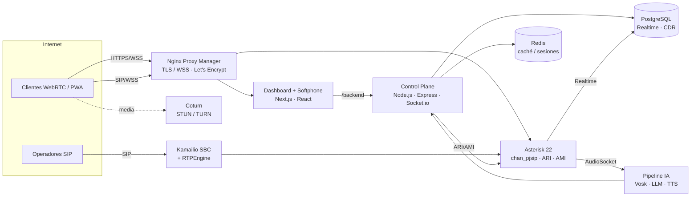

<div align="center">

# ☎️ PBX-NG

### Plataforma de Comunicaciones Unificadas (UCaaS) de nueva generación

**VoIP tradicional + WebRTC · IVR conversacional con IA · multi-dispositivo · alta disponibilidad**


</div>

---

## 📑 Índice

- [Visión general](#-visión-general)
- [Características](#-características)
- [Arquitectura](#-arquitectura)
- [Stack tecnológico](#-stack-tecnológico)
- [Estructura del repositorio](#-estructura-del-repositorio)
- [Puesta en marcha](#-puesta-en-marcha)
- [Configuración](#-configuración)
- [Módulos destacados](#-módulos-destacados)
- [Seguridad](#-seguridad)
- [Roadmap](#-roadmap)
- [Licencia](#-licencia)

---

## 🎯 Visión general

**PBX-NG** es una central telefónica IP moderna y modular que une la telefonía VoIP clásica (teléfonos físicos SIP) con la web (WebRTC), permitiendo comunicarse desde el navegador o el celular **sin plugins ni instalaciones**. Está pensada como servicio multi-empresa (UCaaS), con un plano de control por API, un panel de administración en tiempo real y un softphone PWA instalable.

Todo el plan de marcado, los internos y la configuración viven en **PostgreSQL** mediante *Asterisk Realtime Architecture (ARA)*, por lo que la operación es 100% dinámica desde el panel, sin tocar archivos en el servidor.

---

## ✨ Características

| Área | Funcionalidades |
|------|-----------------|
| **Telefonía core** | Asterisk 22 LTS · `chan_pjsip` · Realtime sobre PostgreSQL · CDR · transcoding G.711/G.722/Opus |
| **WebRTC** | Softphone en el panel y PWA instalable (SIP.js) · SRTP/DTLS sobre WSS · STUN/TURN (Coturn) |
| **Internos** | WebRTC y SIP físico · estado en vivo (registrado / en llamada / offline) · IP + RTT · QR de alta |
| **Aplicaciones** | Colas/ACD · IVR visual (React Flow) · conferencias · ring groups · paging · buzón de voz |
| **IVR con IA** 🤖 | Conversacional voz-a-voz (STT→LLM→TTS) · modo demo offline (Vosk + espeak) u OpenAI · transferencia y CRM por *function-calling* |
| **Click-to-Call** 🌐 | Enlaces y QR públicos para llamar por WebRTC sin registro · invitados efímeros · metadatos del cliente |
| **Push (RFC 8599)** 🔔 | Despertar dispositivos dormidos · Web Push (VAPID) + FCM + APNs (VoIP) |
| **Auto-provisioning** 📞 | Teléfonos físicos (Yealink / Grandstream) configurados solos por dirección MAC |
| **Troncales** | Registro contra operadores SIP · rutas entrantes (DID) y salientes por prefijo |
| **SBC** | Kamailio + RTPEngine de borde · dispatcher · anti-flood (pike) · gestión desde el panel |
| **Monitoreo** | Wallboard de colas · monitor de llamadas en vivo (escuchar / susurrar / irrumpir) · grabaciones |
| **Seguridad** | TLS/WSS · SRTP · Fail2Ban + geolocalización de ataques · JWT · defensa en capas |

---

## 🏗 Arquitectura



El **plano de medios** puede ir directo entre puntos o relayarse por Coturn/RTPEngine según la red (NAT). El **plano de señalización** entra por NPM (WebRTC) o por el SBC (troncales).

---

## 🧰 Stack tecnológico

- **Core de comunicaciones:** Asterisk 22 LTS (`chan_pjsip`, SRTP, DTLS, AudioSocket).
- **Control plane:** Node.js + Express + Socket.io, consumiendo **ARI** (control de llamadas) y **AMI** (eventos).
- **Frontend:** Next.js 14 + React + Mantine UI (panel, softphone WebRTC y PWA).
- **Base de datos:** PostgreSQL (Realtime + CDR + config) y Redis (caché/estado).
- **SBC / escala:** Kamailio + RTPEngine.
- **Borde / TLS:** Nginx Proxy Manager (Let's Encrypt) + Coturn (STUN/TURN).
- **IA de voz:** Vosk (STT offline ES) · espeak-ng (TTS offline) · OpenAI (Whisper/GPT/TTS) opcional.

---

## 📂 Estructura del repositorio

```
pbx-ng/
├── control-plane/          # API Node.js (ARI/AMI + Socket.io)
│   ├── app.js              #   API principal, endpoints, realtime
│   ├── ai-pipeline.js      #   IVR conversacional (AudioSocket + STT/LLM/TTS)
│   ├── push-providers.js   #   Push RFC 8599 (FCM + APNs)
│   └── ai/vosk_stt.py      #   Sidecar STT offline (Vosk)
├── dashboard/              # Panel + softphone (Next.js)
│   ├── app/                #   Páginas y componentes (App Router)
│   ├── public/             #   PWA, service worker, assets
│   └── next.config.js
├── infra/
│   ├── asterisk/           # Configs Asterisk (realtime, pjsip, ari, http, rtp…)
│   ├── sbc/                # Notas del SBC (Kamailio/RTPEngine)
│   └── systemd/            # Unidades systemd de los servicios
├── docs/
├── .env.example
└── README.md
```

---

## 🚀 Puesta en marcha

> Topología de referencia: contenedores LXC/VM en un hipervisor (Proxmox). Asterisk, PostgreSQL/Redis, el control plane + panel, el SBC y Coturn pueden ir separados.

### 1. Base de datos
PostgreSQL con el esquema de **Asterisk Realtime** (`ps_endpoints`, `ps_aors`, `ps_auths`, `extensions`…), CDR y las tablas de la app (`pbxng_*`).

### 2. Asterisk
Asterisk 22 con `res_config_pgsql` cableado (ver `infra/asterisk/`): `sorcery.conf`, `extconfig.conf`, `res_pgsql.conf`. Habilitar ARI (`ari.conf` + `http.conf`) y AMI (`manager.conf`) restringidos a la LAN.

### 3. Control plane (API)
```bash
cd control-plane
cp ../.env.example .env     # completá credenciales
npm install
node app.js                 # o vía systemd: infra/systemd/pbxng-api.service
```

### 4. Dashboard
```bash
cd dashboard
npm install
npm run build && npm start  # o vía systemd: infra/systemd/pbxng-dashboard.service
```

### 5. Borde
NPM publica el dominio con TLS/WSS y enruta `/` → panel, `/backend` → API, `/ws` → Asterisk, `/socket.io` → API, `/prov` → API. Coturn para NAT traversal.

---

## ⚙️ Configuración

- **`.env`** (control plane): conexión a DB, ARI, AMI, JWT y VAPID. Ver [`.env.example`](.env.example).
- **Panel → Configuración / Notificaciones:** las claves sensibles que dependen del cliente **no van en `.env`**; se cargan cifradas en la tabla `pbxng_settings`:
  - **OpenAI** (IVR con IA), **FCM / APNs** (push nativo), **SMTP por empresa** (email), **servidor de provisioning**.

---

## 🌟 Módulos destacados

### 🤖 IVR conversacional con IA
Las llamadas a un agente IA pasan por un pipeline **STT → LLM → TTS** sobre **AudioSocket**. Funciona 100% **offline** (Vosk + espeak-ng) sin claves, o con **OpenAI** (Whisper + GPT + TTS) cargando la key. Soporta *barge-in* (interrumpir al bot) y **function-calling**: transferir a un área/persona y consultar un CRM por webhook.

### 🌐 Click-to-Call público
Generás un enlace/QR apuntado a un interno, cola, IVR o agente IA. El cliente externo llama por **WebRTC desde el navegador, sin instalar ni registrarse**; se crea un invitado SIP efímero aislado y su nombre/geo viajan con la llamada.

### 🔔 Push RFC 8599
Despierta dispositivos en segundo plano al entrar una llamada. Capa multi-proveedor: **Web Push (VAPID)** para la PWA y **FCM (Android)** + **APNs VoIP (iOS)** listos para app nativa, leyendo los parámetros `pn-provider/pn-prid/pn-param`.

### 📞 Auto-provisioning de teléfonos
Los teléfonos **Yealink** y **Grandstream** se configuran solos: piden su archivo por MAC (`<mac>.cfg` / `cfg<mac>.xml`) al servidor de provisioning y reciben su cuenta SIP, codecs y etiquetas. El usuario solo enchufa el teléfono (DHCP opción 66).

### 🛡 SBC (Kamailio)
Proxy SIP de borde con **dispatcher**, **anti-flood (pike/ipban)** y **RTPEngine** para relay de medios. Administrable desde el panel (`/sbc`) con gráficas en vivo y editor de `kamailio.cfg` validado.

---

## 🔒 Seguridad

- **Cifrado total:** TLS para señalización SIP/WSS y SRTP/DTLS para el medio (RTP).
- **Perímetro:** Fail2Ban adaptado a logs PJSIP + geolocalización de ataques; pike/ipban en el SBC.
- **Acceso:** panel con JWT; rutas públicas acotadas (enrolamiento, click-to-call, provisioning).
- **Secretos:** credenciales fuera del código (`.env` + `pbxng_settings`); este repo no contiene claves reales.

---

## 🗺 Roadmap

- [x] Core PJSIP + Realtime + CDR
- [x] WebRTC (panel + PWA) con TURN
- [x] Colas, IVR visual, conferencias, grupos, buzón
- [x] SBC Kamailio + RTPEngine
- [x] IVR conversacional con IA (offline / OpenAI)
- [x] Click-to-Call público (WebRTC + QR)
- [x] Push RFC 8599 (Web Push / FCM / APNs)
- [x] Auto-provisioning Yealink / Grandstream
- [ ] SSO / OAuth2 para el panel + credenciales PJSIP temporales
- [ ] Analítica post-llamada (transcripción + sentimiento + resumen)
- [ ] Multi-tenant a nivel core (aislamiento por contextos)

---

## 📄 Licencia

Proyecto propietario de **IES**. Todos los derechos reservados.

<div align="center">
<sub>Construido con ❤️ para comunicaciones unificadas modernas.</sub>
</div>
