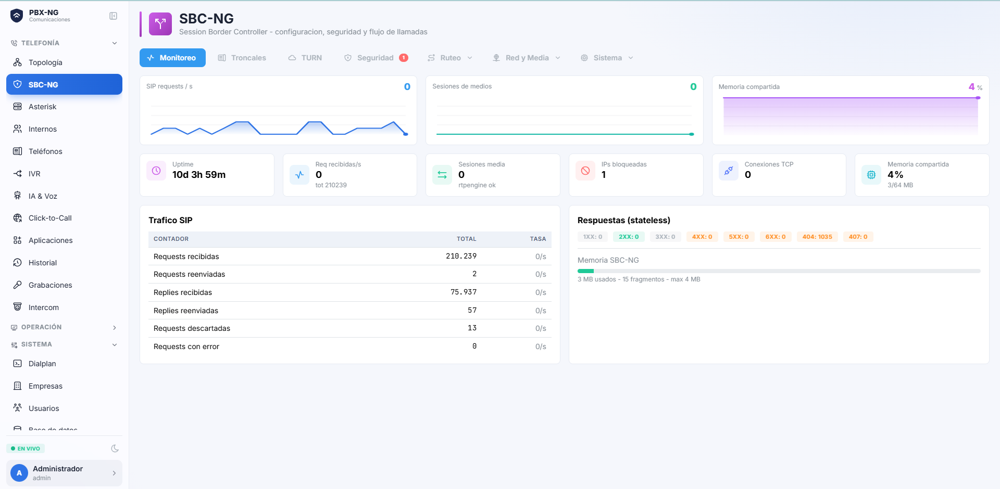

# Manual de Configuración

> **Para quién es este manual**
> Para el administrador de la central: la persona que crea los internos, arma las colas, conecta
> las troncales y decide quién recibe qué. No requiere conocimientos de telefonía previa.

---

## 1. El panel de administración

Se entra con el usuario `admin` en `https://tu-dominio`. El menú lateral agrupa todo en secciones;
las que más vas a usar son **Internos**, **Aplicaciones**, **Troncales** y **Configuración**.

---

## 2. Internos (extensiones)

Un **interno** es una línea telefónica: el 2001 de recepción, el 3005 de un vendedor. Puede ser un
teléfono físico, un softphone en la computadora o la app del celular.

### 2.1 Crear un interno

En **Internos → Nuevo**. Lo mínimo es el número y el nombre. Cada interno nace con:

- Su **contraseña SIP**, generada automáticamente.
- Su **buzón de voz activado**, con PIN inicial igual al número de interno.

### 2.2 Entregarle el teléfono al usuario

No le dictes contraseñas por teléfono. Usá el botón **Enviar acceso por correo**: la persona recibe
un mail con un **código QR** y un enlace. Lo escanea con el celular y su teléfono queda configurado
solo. El mismo enlace sirve para la app de escritorio.

> El acceso **vence en 24 horas**. Si expira, generá uno nuevo.

---

## 3. Troncales

La **troncal** es la línea que te conecta con el mundo: el proveedor por el que entran y salen las
llamadas.

### 3.1 Dar de alta una troncal SIP

En **Troncales → Nueva**, cargá los datos que te dio el proveedor: host, puerto, usuario y
contraseña. Marcá **registrar** si el proveedor lo exige.

El panel muestra el estado en vivo: **verde** si la troncal responde, **rojo** si no.

> **Activá la alerta de "troncal caída"** (Configuración → Alertas). Si la troncal se cae, dejás de
> recibir llamadas — y sin alerta te enterás cuando un cliente se queja.

### 3.2 Rutas entrantes y salientes

- **Ruta entrante**: qué pasa cuando llaman a un número tuyo (DID). Puede ir a un interno, a un IVR
  o a una cola.
- **Ruta saliente**: por qué troncal sale cada llamada según lo que se marque.

---

## 4. Colas de llamadas

Una **cola** reparte las llamadas entre varios agentes: soporte, ventas, mesa de entrada.

### 4.1 Crear una cola

En **Aplicaciones → Colas → Nueva cola**. El editor tiene tres pestañas.

**Básico** — lo que define el comportamiento:

| Campo | Qué significa | Recomendación |
|---|---|---|
| Estrategia | Cómo se elige al agente | *Round-robin con memoria* reparte parejo |
| Timbrado del agente | Cuánto suena en cada uno | 20-25 segundos |
| **Descanso del agente** | Tiempo para tipificar antes de la próxima llamada | **Al menos 10 s**; en 0 el agente se quema |
| Capacidad máxima | Cuántas llamadas pueden esperar | 0 = sin límite |
| Espera máxima + destino | Qué hacer si nadie atiende | Buzón o interno de respaldo |

**Anuncios** — acá está la diferencia con otras centrales: **no hay que subir archivos de audio**.
Escribís el texto, elegís la voz y lo escuchás antes de guardar. El sistema lo sintetiza y lo
publica solo.

- *Bienvenida*: se reproduce al entrar a la cola.
- *Anuncio periódico*: se repite mientras la persona espera.
- *Posición y tiempo de espera*: los locuta la central con su propia voz.

**Avanzado** — qué hacer si no hay agentes, SLA objetivo, pausa automática al que no atiende.

### 4.2 Agentes

Se agregan desde la tarjeta de la cola. El punto verde indica que están conectados.

---

## 5. Buzón de voz

Cada interno **ya tiene buzón**. El usuario lo escucha marcando **`*97`** desde su teléfono
(PIN inicial = su número de interno).

### 5.1 Mandar los mensajes al correo

En **Aplicaciones → Buzones**, panel *"Mensaje de voz al correo"*: cargá la dirección y activá el
envío. A partir de ahí, cada mensaje nuevo llega por mail con:

- El **audio adjunto**.
- La **transcripción automática** del mensaje en el cuerpo del correo.

Podés elegir si además querés que se borre del buzón después de enviarlo (modo "solo correo").

---

## 6. Correo saliente

Sin esto no funcionan ni los avisos de buzón ni las alertas.

En **Configuración → Email**: host, puerto, usuario y contraseña del SMTP. Guardá y usá el botón
**Probar**: si algo está mal, el sistema te dice exactamente qué.

> **Con Gmail o Google Workspace**: si la cuenta tiene verificación en dos pasos, la contraseña
> normal **no sirve** para SMTP. Hay que generar una **contraseña de aplicación**. Es el error más
> frecuente, y el panel te lo señala con esas palabras.

---

## 7. Alertas automáticas

En **Configuración → Alertas**. Cargá el destinatario arriba y encendé lo que quieras recibir. Cada
alerta tiene un botón de **prueba** que manda el correo sin necesidad de activarla.

| Alerta | Cuándo llega |
|---|---|
| **Estamos bajo ataque** | Ráfaga de intentos de registro fallidos. Llega **una** alerta agrupada, no una por IP |
| IP bloqueada | El firewall bloqueó una IP (con país e ISP) |
| Inicio de sesión al panel | Alguien entró — por defecto, **solo desde una IP nueva** |
| Intentos fallidos al panel | Posible fuerza bruta contra el administrador |
| **Troncal caída / recuperada** | Se cortó (o volvió) la línea con el proveedor |
| Servicio caído | Base de datos o Asterisk sin conexión |
| Cola sin agentes | En horario laboral no hay nadie para atender |
| Llamada muy larga | Primer síntoma habitual de fraude telefónico |
| Salientes fuera de horario | El patrón clásico: ráfaga de llamadas de madrugada |
| Llamada internacional | Destinos que no deberían marcarse |
| Resumen diario | Un correo a la mañana con lo de ayer |

> **Por qué el aviso de login viene con "solo IP nueva" activado:** si te avisa de *todos* los
> ingresos, en una semana lo mandás a la papelera y dejás de leerlo. La señal que importa es
> "alguien entró desde un lugar donde nunca entraste".

---

## 8. Grabación de llamadas

Se puede grabar por interno, por cola o todo. Las grabaciones se escuchan desde **Grabaciones**, con
reproductor y **transcripción con IA** a pedido.

---

## 9. Seguridad

- **Fail2ban** bloquea automáticamente a quien intenta adivinar contraseñas SIP. La sección
  **Seguridad** muestra las IPs bloqueadas con su país y permite desbloquear o bloquear a mano.
- El panel exige cambiar la contraseña del `admin` en el primer ingreso.
- Los usuarios tienen **roles**: administrador, supervisor y agente. Cada uno ve solo lo suyo.

---

## 10. Usuarios y roles

En **Usuarios**. Cada persona puede tener un interno asociado.

| Rol | Qué puede hacer |
|---|---|
| **Administrador** | Todo |
| **Supervisor** | Monitorear colas y agentes, escuchar/susurrar/irrumpir en llamadas, gestionar clientes |
| **Agente** | Su softphone, su historial y su buzón |

