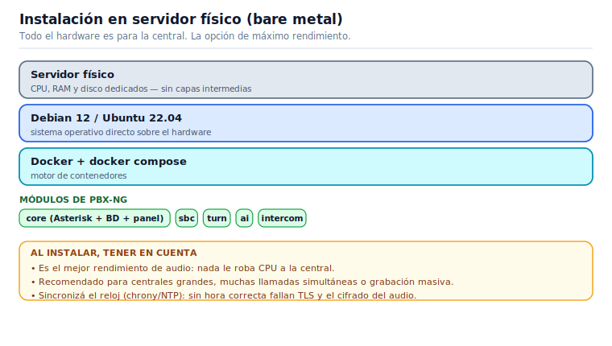
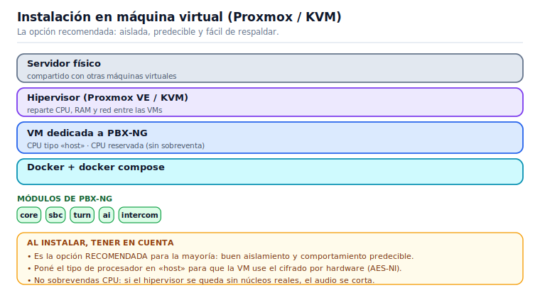
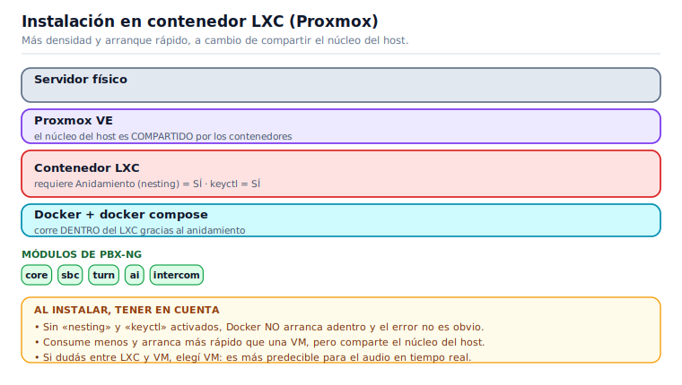
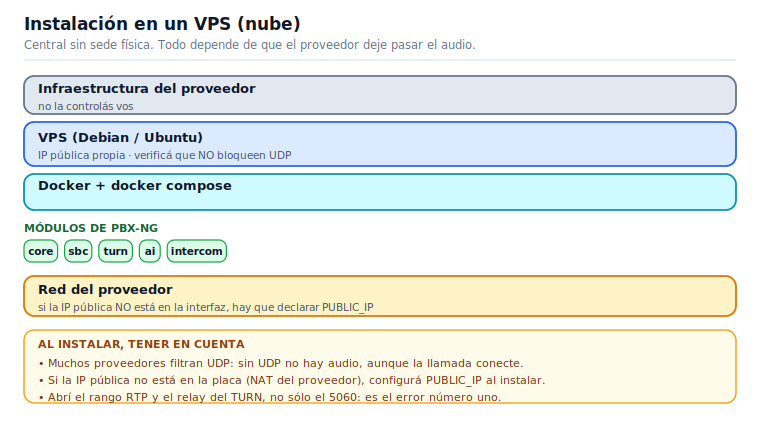
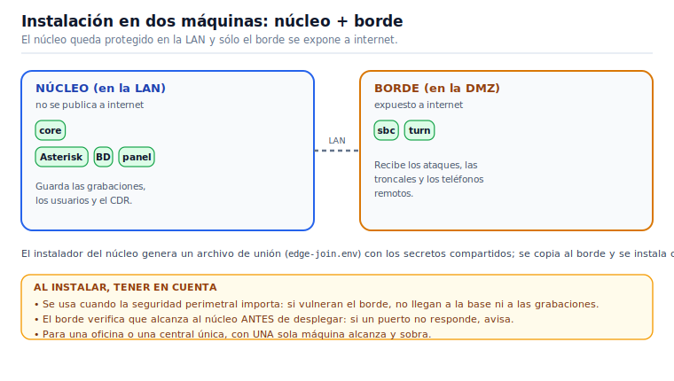

# Manual de Instalación

> **Para quién es este manual**
> Para la persona que instala PBX-NG por primera vez en un servidor: técnico, integrador o
> administrador de sistemas. No hace falta saber de Asterisk; sí manejarse con una terminal Linux.

---

## 1. Antes de empezar

### 1.1 Qué vas a instalar

PBX-NG es una central telefónica que se despliega como **appliance**: un conjunto de módulos
independientes que se activan según lo que necesite el cliente. Cada módulo es un contenedor.

| Módulo | Qué aporta | ¿Es obligatorio? |
|---|---|---|
| `core` | Asterisk, base de datos, API y panel de administración | **Sí** |
| `sbc` | Borde SIP: seguridad, troncales, anclaje de medios | Solo si hay troncales SIP |
| `turn` | Traversía de NAT para los teléfonos WebRTC | **Sí** si hay softphones fuera de la red |
| `ai` | Motor de voz: TTS (anuncios) y STT (transcripciones) | Opcional |
| `intercom` | Video de porteros y cámaras (RTSP → navegador) | Opcional |
| `proxy` | Reverse proxy con certificados TLS | Solo si no tenés uno propio |

### 1.2 Requisitos

- **Servidor**: Debian 12 o Ubuntu 22.04, 2 vCPU y 4 GB de RAM como mínimo (más si vas a
  transcodificar muchas llamadas simultáneas).
- **Docker** y el plugin `docker compose`.
- **Un dominio** apuntando al servidor (por ejemplo `pbx.cliente.com`) y su certificado TLS.
- **Los puertos abiertos** que se detallan en la sección 4. **Este punto no es opcional**: es la
  causa número uno de instalaciones "que registran pero no tienen audio".


---

## 2. Dónde instalarlo: tipos de host

PBX-NG corre sobre Docker, así que técnicamente anda en cualquier Linux. Pero **la telefonía en
tiempo real no perdona la sobreventa de recursos**: si el hipervisor le roba CPU a la máquina un
milisegundo de más, eso se escucha como audio entrecortado. Esta sección es para elegir bien.

### 2.1 Comparación

| Tipo de host | Cuándo conviene | Qué tener en cuenta |
|---|---|---|
| **Servidor físico (bare metal)** | Centrales grandes, muchas llamadas simultáneas, grabación masiva | El mejor rendimiento de audio. Sin capas de virtualización que agreguen *jitter* |
| **Máquina virtual (Proxmox / KVM)** | **La opción recomendada** para la mayoría | Reservá la CPU (sin sobreventa). Tipo de CPU `host` para que se aproveche AES-NI en el cifrado |
| **Contenedor LXC (Proxmox)** | Cuando querés densidad y ya tenés Proxmox | Requiere habilitar **anidamiento** para que Docker funcione adentro. Ver 2.3 |
| **VMware ESXi** | Infraestructura corporativa ya montada en VMware | Adaptador **VMXNET3**, reserva de CPU y sincronización horaria con VMware Tools |
| **Hyper-V** | Entornos Windows Server | Deshabilitá *Dynamic Memory* para la VM de la central |
| **VPS en la nube** | Central sin sede física, teletrabajo | Verificá que el proveedor **no bloquee UDP** y configurá `PUBLIC_IP` si la IP pública no está en la interfaz |

### 2.1.1 Cómo se instala en cada arquitectura

Un diagrama por tipo de host, con las capas reales y lo que hay que mirar al instalar. Buscá el
que corresponde a tu caso: son los cuatro escenarios que cubren casi todas las instalaciones.

**Servidor físico** — todo el hardware es para la central. Máximo rendimiento de audio, sin
capas que le roben CPU.



**Máquina virtual (Proxmox / KVM)** — la opción recomendada para la mayoría. Aislada,
predecible y fácil de respaldar; hay que reservarle CPU y usar tipo de procesador `host`.



**Contenedor LXC (Proxmox)** — más densidad y arranque más rápido, pero comparte el núcleo del
host. Exige activar **anidamiento** y **keyctl**, o Docker no arranca adentro.



**VPS en la nube** — para una central sin sede física. Todo depende de que el proveedor deje
pasar UDP y de declarar bien la IP pública.



### 2.2 Recursos mínimos

| Escenario | vCPU | RAM | Disco |
|---|---|---|---|
| Hasta 20 extensiones, sin grabación | 2 | 4 GB | 40 GB |
| Hasta 50 extensiones con grabación | 4 | 8 GB | 200 GB+ |
| Con módulo de IA (transcripción) | +2 | +4 GB | +10 GB (modelos) |

> El disco crece con las **grabaciones**. Una llamada grabada ocupa aproximadamente 0,5 MB por
> minuto. Si vas a grabar todo, hacé la cuenta antes, no después.

### 2.3 Proxmox: VM o contenedor LXC

**En una VM (KVM)** no hay nada especial que hacer: instalás Debian, Docker, y seguís el manual.
Configurá el tipo de procesador como **`host`** para que la máquina virtual vea las instrucciones
de cifrado del procesador real (el audio cifrado las usa).

**En un contenedor LXC** hay que habilitar dos cosas para que Docker pueda correr adentro. En las
opciones del contenedor:

- **Anidamiento (`nesting`)**: activado.
- **`keyctl`**: activado.

Sin eso, Docker no arranca dentro del LXC y el error no es obvio.

> **¿VM o LXC?** El LXC consume menos y arranca más rápido; la VM está mejor aislada y es más
> predecible para el audio. Si tenés dudas, usá **VM**.

### 2.4 Instalación asistida en Proxmox

Si tenés un clúster Proxmox, hay un orquestador que **crea los contenedores por vos**: te pregunta
cómo querés repartir los módulos, en qué nodo va cada uno, y los aprovisiona solo.

```bash
# En cualquier nodo Proxmox, como root:
curl -fsSLO https://raw.githubusercontent.com/flavioGonz/pbx-ng/main/deploy/pbxng-proxmox.sh
chmod +x pbxng-proxmox.sh && ./pbxng-proxmox.sh
```


### 2.5 Cosas que arruinan el audio (en cualquier host)

Estas cuatro explican la enorme mayoría de los problemas de calidad. Revisalas **antes** de culpar
a la central:

1. **Sobreventa de CPU.** Si el hipervisor tiene más vCPU asignadas que núcleos reales y todos
   trabajan, el audio se corta. La central necesita CPU *cuando la necesita*.
2. **Reloj desincronizado.** Sin NTP, fallan los certificados TLS, el cifrado del audio y los
   registros de llamadas quedan con horas absurdas. Instalá `chrony` o `systemd-timesyncd`.
3. **SIP ALG en el router.** Es una "ayuda" que reescribe los paquetes SIP y los rompe.
   **Desactivalo siempre.** Está encendido de fábrica en muchos routers hogareños.
4. **Firewall incompleto.** Ver la sección de firewall: es la causa número uno de "registra pero no
   hay audio".

---

## 3. Elegir la topología

### 3.1 Una sola máquina (recomendado para empezar)

Todo corre en un servidor. Es lo indicado para una central única, una oficina, o una prueba.

### 3.2 Dos máquinas: núcleo + borde

El **núcleo** (Asterisk, base de datos, panel) queda en la LAN, y el **borde** (SBC, TURN) en la
DMZ, expuesto a Internet. Es la topología que se usa cuando la seguridad perimetral importa: si
alguien vulnera el borde, no llega a la base de datos ni a las grabaciones.




---

## 4. Instalación

### 4.1 Descargar e instalar

```bash
git clone https://github.com/flavioGonz/pbx-ng.git
cd pbx-ng/docker
./install.sh
```

El instalador es **interactivo**: te pregunta el rol de la máquina, qué módulos querés levantar,
el dominio y la IP pública. **Genera todos los secretos solo** (contraseñas de base de datos, JWT,
ARI, AMI, TURN) y los guarda en `docker/.env` con permisos restringidos.

> **Nunca edites `.env` a mano para poner contraseñas.** El instalador tiene un control previo que
> aborta si detecta un secreto débil o de ejemplo. Está ahí por algo.

### 4.2 Qué te pregunta, una por una

El instalador hace pocas preguntas, pero cada una define el despliegue. Esto es exactamente lo que
vas a ver, en orden, y qué conviene responder:

| # | Pregunta | Opciones | Qué elegir |
|---|---|---|---|
| 1 | **Rol de la máquina** | `1) Todo` · `2) core` · `3) edge` | **Todo** si es un solo servidor (lo habitual). `core`/`edge` sólo si vas a separar núcleo y borde (ver 3.2) |
| 2 | **Módulos (perfiles)** | `1) Todo` · `2) Elegir` · `3) Solo core` | **Todo** para una central completa. **Solo core** si no hay troncales SIP ni teléfonos remotos |
| 2b | Si elegiste *Elegir*: `sbc`, `turn`, `ai`, `intercom` | s/n cada uno | `sbc` y `turn` si hay troncales o softphones fuera de la LAN; `ai` e `intercom` son opcionales |
| 3 | **¿Desplegar Nginx Proxy Manager?** | s/n (default **n**) | **n** si ya tenés un reverse proxy o certificados propios. **s** si querés que la central resuelva TLS sola |
| 4 | **Dominio público** | texto (default `pbx.tu-dominio.com`) | El FQDN real que ya apunta a este servidor. **No inventes uno**: de acá salen los certificados y el WSS del softphone |
| 5 | **IP pública (TURN/RTP)** | IP o vacío | La IP WAN por la que entra el audio. Dejala vacía sólo si el servidor ya tiene la IP pública en su interfaz |
| 6 | **IP del EDGE/SBC en la LAN** *(sólo rol `core`)* | IP o vacío | La IP del borde. Vacío si todavía no lo instalaste |

> **La 4 y la 5 son las que más se equivocan.** Si el dominio no resuelve a este servidor, el
> certificado no se emite y el softphone web no conecta. Si la IP pública está mal, la llamada
> conecta pero **no se escucha nada**: el audio se anuncia hacia una dirección equivocada.

Si instalás el rol **`edge`**, el instalador exige saber dónde está el núcleo (`--join=` o
`--core-ip=`) y **verifica los puertos del core antes de desplegar**. Si alguno no responde te
avisa y pregunta si querés seguir igual: contestá **n** y arreglá la conectividad primero, porque
un borde que no llega al núcleo no sirve para nada.

### 4.3 Instalación no interactiva (para automatizar)

Todas las respuestas se pueden pasar por parámetro. Es lo que se usa para reinstalar igual, para
scripts de aprovisionamiento o para dejar documentado un despliegue:

| Flag | Qué define | Ejemplo |
|---|---|---|
| `--role=` | Rol de la máquina | `all` · `core` · `edge` |
| `--profiles=` | Módulos extra (core va siempre) | `sbc,turn,ai` |
| `--domain=` | Dominio público | `pbx.cliente.com` |
| `--public-ip=` | IP WAN para TURN/RTP | `200.40.30.9` |
| `--edge-ip=` | IP del borde en la LAN (rol core) | `10.0.0.20` |
| `--core-ip=` | IP del núcleo (rol edge) | `10.0.0.10` |
| `--join=` | Archivo de unión con los secretos compartidos (rol edge) | `edge-join.env` |
| `--tenant=` | Modo de inquilinos | `single` (default) · `multi` |
| `--yes` / `-y` | No preguntar nada, usar defaults | — |
| `--print-firewall` | Sólo imprime los puertos a abrir y sale | — |

```bash
# Todo en una máquina, sin preguntas:
./install.sh --role=all --profiles=sbc,turn --domain=pbx.cliente.com --public-ip=200.40.30.9 --yes
```

### 4.4 Instalación en dos máquinas

Primero el **núcleo**, que genera el archivo de unión con los secretos compartidos:

```bash
./install.sh --role=core --public-ip=<IP_WAN> --domain=pbx.cliente.com --edge-ip=<IP_LAN_DEL_BORDE>
```

Copiá ese archivo al borde e instalá allí:

```bash
scp docker/edge-join.env root@<IP_BORDE>:/opt/pbx-ng/docker/
# en el borde:
./install.sh --role=edge --join=edge-join.env --public-ip=<IP_WAN>
```

El borde valida que llegue al núcleo (base de datos, AMI, ARI) **antes** de desplegar nada.


### 4.5 Primer acceso

Al terminar, el instalador imprime la contraseña inicial del usuario `admin`. Entrá al panel
(`https://tu-dominio`) y **cambiala en el primer ingreso** — el sistema te lo va a exigir.

Adentro del panel, en **Sistema → Manuales**, están estos tres manuales: se pueden leer en pantalla,
descargar en PDF (con la versión del producto impresa en la portada) o bajar en Markdown. Van con la
central, así que sirven también donde no hay Internet — y es lo que le entregás al cliente junto con
el appliance.


### 4.6 Verificación: ¿quedó bien instalada?

Que los contenedores estén "up" no prueba que la central funcione. Recorré estos seis puntos **en
este orden**; el primero que falle es el que hay que arreglar antes de seguir:

1. **Los módulos que pediste existen.** `pbxng-ctl status` — tienen que estar los perfiles que
   elegiste, y ninguno reiniciándose.
2. **El panel carga y entrás.** `https://tu-dominio` con el usuario `admin`. Si carga la pantalla
   pero no trae datos, es la API: `docker compose logs api`.
3. **El certificado es válido.** El navegador no debe protestar. Un certificado inválido rompe el
   softphone web (el WSS no levanta) aunque el panel se vea.
4. **Asterisk está vivo.** En **Telefonía → Monitoreo**, el núcleo en verde.
5. **El TURN responde de verdad** (si instalaste `turn`): `scripts/check-turn.py --env docker/.env --tcp`
   tiene que decir `ALLOCATE 200 · relay = …`. El instalador ya corre este chequeo solo al terminar.
6. **Una llamada real entre dos internos.** Creá dos extensiones, registrá dos softphones y llamate.
   Es la única prueba que vale: si hay audio en los dos sentidos, la instalación está sana.

> Si el paso 6 conecta pero **no hay audio**, no busques en Asterisk: es firewall o IP pública.
> Volvé a la sección 5.

### 4.7 Qué guarda el `.env` (referencia)

El instalador genera `docker/.env` y **no hace falta editarlo** en una instalación normal. Estas son
las claves que sí conviene entender si tenés que diagnosticar o migrar el servidor:

| Clave | Qué es | Ojo con |
|---|---|---|
| `DOMAIN` | Dominio público de la central | Debe resolver a este servidor; de acá sale el certificado y el WSS |
| `PUBLIC_IP` | IP WAN que se anuncia para el audio | Si está mal, la llamada conecta y no se escucha |
| `COMPOSE_PROFILES` | Módulos activos | Se cambia con `pbxng-ctl`, no a mano |
| `TENANT_MODE` | `single` o `multi` inquilino | Se define al instalar |
| `DB_HOST` · `ASTERISK_HOST` · `SBC_HOST` · `TURN_HOST` | Dónde vive cada componente | En una sola máquina son la misma IP; en núcleo+borde apuntan cruzado |
| `DB_PASS` · `JWT_SECRET` · `AMI_*` · `ARI_*` · `TURN_PASS` | Secretos generados | **Nunca los pongas a mano**: el instalador aborta si detecta uno débil |

> **Al migrar de servidor**, lo que tenés que llevarte es el `.env`, la base de datos y las
> grabaciones. Sin el `.env` original, los secretos no coinciden y los módulos no se hablan entre sí.

---

## 5. Firewall y NAT

» Verificación: scripts/check-turn.py

**Esta sección decide si la central funciona o no.** La señalización suele pasar sola; el audio es
lo primero que se rompe.

### 5.1 Lo que se publica a Internet

| Puerto | Protocolo | Para qué |
|---|---|---|
| `443` (y `80` para el certificado) | TCP | Panel, softphone web y **WSS** |
| `5060` / `5061` | UDP+TCP / TCP | SIP: troncales y teléfonos físicos |
| `30000-40000` | UDP | Audio (RTP) de las troncales y los teléfonos |
| `3478` | **UDP y TCP** | STUN/TURN — **los dos**, muchas redes bloquean UDP saliente |
| `49152-65535` | UDP | **Rango relay del TURN** |
| `5349` | TCP | TURN sobre TLS (recomendado para redes corporativas) |

> **Los dos errores más comunes:**
> 1. Abrir `3478` y olvidar el rango `49152-65535/UDP`. El teléfono obtiene el candidato de relay,
>    pero el audio nunca fluye. Van juntos, siempre.
> 2. Abrir `3478/UDP` y no `3478/TCP`. Muchas redes corporativas bloquean UDP saliente.

### 5.2 Lo que nunca se publica

`5432` (base de datos), `6379` (Redis), `3000` y `3001` (API y panel, van detrás del proxy),
`5038` (AMI), `8088` (ARI), `81` (admin del proxy).

### 5.3 Verificarlo de verdad

Que el servicio esté "activo" no prueba nada. Verificá lo que hace un teléfono real:

```bash
scripts/check-turn.py --env docker/.env --tcp
```

Si la salida dice **`ALLOCATE 200 · relay = …`**, el TURN está alcanzable **y** autenticado.
Si no, revisá `docs/FIREWALL.md`, que tiene el detalle completo y la trampa del *NAT hairpin*.


---

## 6. Activar y desactivar módulos

» Panel → Sistema → Configuración → Módulos  ·  o pbxng-ctl en la terminal

Un módulo activo es un contenedor que existe; uno inactivo **no existe**. Se maneja desde el panel
(**Configuración → Módulos**) o por línea de comandos:

```bash
pbxng-ctl status              # qué módulos están activos
pbxng-ctl enable  intercom    # crea el contenedor
pbxng-ctl disable intercom    # lo destruye
```


---

## 7. Actualizar la central

Las actualizaciones se hacen por **imagen versionada**, no parchando archivos:

```bash
cd docker
export PBXNG_VERSION=X.Y.Z
./deploy.sh                    # o ./deploy.sh --images=pbxng-X.Y.Z-images.tar.gz (sin internet)
```

`deploy.sh` baja las imágenes, corre las **migraciones de base de datos** y levanta todo. Para
volver atrás, desplegá la versión anterior. El detalle está en `RELEASE.md`.

---

## 8. Si algo no funciona

» Panel → Telefonía → Monitoreo

| Síntoma | Dónde mirar |
|---|---|
| El teléfono registra pero **no hay audio** | Firewall: rango de relay del TURN y `30000-40000/UDP`. Corré `check-turn.py`. |
| El softphone web no conecta | El proxy debe permitir **WebSocket** en `/ws` (y con HTTP/2 **desactivado**). |
| El panel no carga datos | Contenedor `api`: `docker compose logs api`. |
| No entran llamadas | Estado de la troncal en **Monitoreo**. Activá la alerta de *troncal caída*. |


