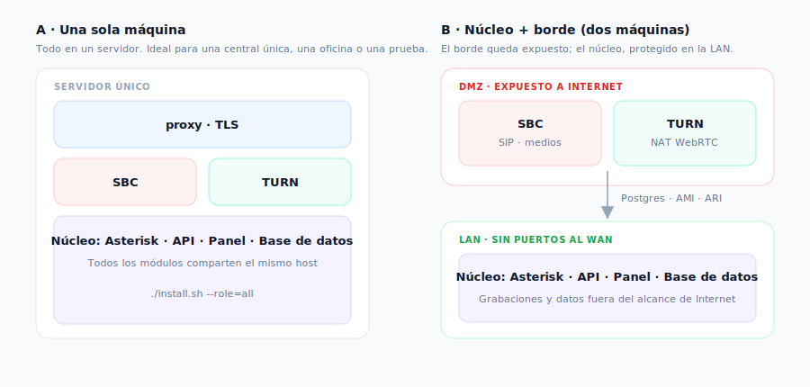

# Manual de Instalación

> **Para quién es este manual**
> Para la persona que instala PBX-NG por primera vez en un servidor: técnico, integrador o
> administrador de sistemas. No hace falta saber de Asterisk; sí manejarse con una terminal Linux.

---

## 1. Antes de empezar

### 1.1 Qué vas a instalar

PBX-NG es una central telefónica que se despliega como **appliance**: un conjunto de módulos
independientes que se activan según lo que necesite el cliente. Cada módulo es un contenedor.

| Módulo | Qué aporta | ¿Es obligatorio? |
|---|---|---|
| `core` | Asterisk, base de datos, API y panel de administración | **Sí** |
| `sbc` | Borde SIP: seguridad, troncales, anclaje de medios | Solo si hay troncales SIP |
| `turn` | Traversía de NAT para los teléfonos WebRTC | **Sí** si hay softphones fuera de la red |
| `ai` | Motor de voz: TTS (anuncios) y STT (transcripciones) | Opcional |
| `intercom` | Video de porteros y cámaras (RTSP → navegador) | Opcional |
| `proxy` | Reverse proxy con certificados TLS | Solo si no tenés uno propio |

### 1.2 Requisitos

- **Servidor**: Debian 12 o Ubuntu 22.04, 2 vCPU y 4 GB de RAM como mínimo (más si vas a
  transcodificar muchas llamadas simultáneas).
- **Docker** y el plugin `docker compose`.
- **Un dominio** apuntando al servidor (por ejemplo `pbx.cliente.com`) y su certificado TLS.
- **Los puertos abiertos** que se detallan en la sección 4. **Este punto no es opcional**: es la
  causa número uno de instalaciones "que registran pero no tienen audio".


---

## 2. Dónde instalarlo: tipos de host

PBX-NG corre sobre Docker, así que técnicamente anda en cualquier Linux. Pero **la telefonía en
tiempo real no perdona la sobreventa de recursos**: si el hipervisor le roba CPU a la máquina un
milisegundo de más, eso se escucha como audio entrecortado. Esta sección es para elegir bien.

### 2.1 Comparación

| Tipo de host | Cuándo conviene | Qué tener en cuenta |
|---|---|---|
| **Servidor físico (bare metal)** | Centrales grandes, muchas llamadas simultáneas, grabación masiva | El mejor rendimiento de audio. Sin capas de virtualización que agreguen *jitter* |
| **Máquina virtual (Proxmox / KVM)** | **La opción recomendada** para la mayoría | Reservá la CPU (sin sobreventa). Tipo de CPU `host` para que se aproveche AES-NI en el cifrado |
| **Contenedor LXC (Proxmox)** | Cuando querés densidad y ya tenés Proxmox | Requiere habilitar **anidamiento** para que Docker funcione adentro. Ver 2.3 |
| **VMware ESXi** | Infraestructura corporativa ya montada en VMware | Adaptador **VMXNET3**, reserva de CPU y sincronización horaria con VMware Tools |
| **Hyper-V** | Entornos Windows Server | Deshabilitá *Dynamic Memory* para la VM de la central |
| **VPS en la nube** | Central sin sede física, teletrabajo | Verificá que el proveedor **no bloquee UDP** y configurá `PUBLIC_IP` si la IP pública no está en la interfaz |

### 2.2 Recursos mínimos

| Escenario | vCPU | RAM | Disco |
|---|---|---|---|
| Hasta 20 internos, sin grabación | 2 | 4 GB | 40 GB |
| Hasta 50 internos con grabación | 4 | 8 GB | 200 GB+ |
| Con módulo de IA (transcripción) | +2 | +4 GB | +10 GB (modelos) |

> El disco crece con las **grabaciones**. Una llamada grabada ocupa aproximadamente 0,5 MB por
> minuto. Si vas a grabar todo, hacé la cuenta antes, no después.

### 2.3 Proxmox: VM o contenedor LXC

**En una VM (KVM)** no hay nada especial que hacer: instalás Debian, Docker, y seguís el manual.
Configurá el tipo de procesador como **`host`** para que la máquina virtual vea las instrucciones
de cifrado del procesador real (el audio cifrado las usa).

**En un contenedor LXC** hay que habilitar dos cosas para que Docker pueda correr adentro. En las
opciones del contenedor:

- **Anidamiento (`nesting`)**: activado.
- **`keyctl`**: activado.

Sin eso, Docker no arranca dentro del LXC y el error no es obvio.

> **¿VM o LXC?** El LXC consume menos y arranca más rápido; la VM está mejor aislada y es más
> predecible para el audio. Si tenés dudas, usá **VM**.

### 2.4 Instalación asistida en Proxmox

Si tenés un clúster Proxmox, hay un orquestador que **crea los contenedores por vos**: te pregunta
cómo querés repartir los módulos, en qué nodo va cada uno, y los aprovisiona solo.

```bash
# En cualquier nodo Proxmox, como root:
curl -fsSLO https://raw.githubusercontent.com/flavioGonz/pbx-ng/main/deploy/pbxng-proxmox.sh
chmod +x pbxng-proxmox.sh && ./pbxng-proxmox.sh
```


### 2.5 Cosas que arruinan el audio (en cualquier host)

Estas cuatro explican la enorme mayoría de los problemas de calidad. Revisalas **antes** de culpar
a la central:

1. **Sobreventa de CPU.** Si el hipervisor tiene más vCPU asignadas que núcleos reales y todos
   trabajan, el audio se corta. La central necesita CPU *cuando la necesita*.
2. **Reloj desincronizado.** Sin NTP, fallan los certificados TLS, el cifrado del audio y los
   registros de llamadas quedan con horas absurdas. Instalá `chrony` o `systemd-timesyncd`.
3. **SIP ALG en el router.** Es una "ayuda" que reescribe los paquetes SIP y los rompe.
   **Desactivalo siempre.** Está encendido de fábrica en muchos routers hogareños.
4. **Firewall incompleto.** Ver la sección de firewall: es la causa número uno de "registra pero no
   hay audio".

---

## 3. Elegir la topología

### 3.1 Una sola máquina (recomendado para empezar)

Todo corre en un servidor. Es lo indicado para una central única, una oficina, o una prueba.

### 3.2 Dos máquinas: núcleo + borde

El **núcleo** (Asterisk, base de datos, panel) queda en la LAN, y el **borde** (SBC, TURN) en la
DMZ, expuesto a Internet. Es la topología que se usa cuando la seguridad perimetral importa: si
alguien vulnera el borde, no llega a la base de datos ni a las grabaciones.



---

## 4. Instalación

### 4.1 Descargar e instalar

```bash
git clone https://github.com/flavioGonz/pbx-ng.git
cd pbx-ng/docker
./install.sh
```

El instalador es **interactivo**: te pregunta el rol de la máquina, qué módulos querés levantar,
el dominio y la IP pública. **Genera todos los secretos solo** (contraseñas de base de datos, JWT,
ARI, AMI, TURN) y los guarda en `docker/.env` con permisos restringidos.

> **Nunca edites `.env` a mano para poner contraseñas.** El instalador tiene un control previo que
> aborta si detecta un secreto débil o de ejemplo. Está ahí por algo.

### 4.2 Instalación en dos máquinas

Primero el **núcleo**, que genera el archivo de unión con los secretos compartidos:

```bash
./install.sh --role=core --public-ip=<IP_WAN> --domain=pbx.cliente.com --edge-ip=<IP_LAN_DEL_BORDE>
```

Copiá ese archivo al borde e instalá allí:

```bash
scp docker/edge-join.env root@<IP_BORDE>:/opt/pbx-ng/docker/
# en el borde:
./install.sh --role=edge --join=edge-join.env --public-ip=<IP_WAN>
```

El borde valida que llegue al núcleo (base de datos, AMI, ARI) **antes** de desplegar nada.


### 4.3 Primer acceso

Al terminar, el instalador imprime la contraseña inicial del usuario `admin`. Entrá al panel
(`https://tu-dominio`) y **cambiala en el primer ingreso** — el sistema te lo va a exigir.


---

## 5. Firewall y NAT

» Verificación: scripts/check-turn.py  ·  Panel → SBC-NG → TURN

**Esta sección decide si la central funciona o no.** La señalización suele pasar sola; el audio es
lo primero que se rompe.

### 5.1 Lo que se publica a Internet

| Puerto | Protocolo | Para qué |
|---|---|---|
| `443` (y `80` para el certificado) | TCP | Panel, softphone web y **WSS** |
| `5060` / `5061` | UDP+TCP / TCP | SIP: troncales y teléfonos físicos |
| `30000-40000` | UDP | Audio de las troncales (rtpengine) |
| `3478` | **UDP y TCP** | STUN/TURN — **los dos**, muchas redes bloquean UDP saliente |
| `49152-65535` | UDP | **Rango relay del TURN** |
| `5349` | TCP | TURN sobre TLS (recomendado para redes corporativas) |

> **Los dos errores más comunes:**
> 1. Abrir `3478` y olvidar el rango `49152-65535/UDP`. El teléfono obtiene el candidato de relay,
>    pero el audio nunca fluye. Van juntos, siempre.
> 2. Abrir `3478/UDP` y no `3478/TCP`. Muchas redes corporativas bloquean UDP saliente.

### 5.2 Lo que nunca se publica

`5432` (base de datos), `6379` (Redis), `3000` y `3001` (API y panel, van detrás del proxy),
`5038` (AMI), `8088` (ARI), `81` (admin del proxy).

### 5.3 Verificarlo de verdad

Que el servicio esté "activo" no prueba nada. Verificá lo que hace un teléfono real:

```bash
scripts/check-turn.py --env docker/.env --tcp
```

Si la salida dice **`ALLOCATE 200 · relay = …`**, el TURN está alcanzable **y** autenticado.
Si no, revisá `docs/FIREWALL.md`, que tiene el detalle completo y la trampa del *NAT hairpin*.


---

## 6. Activar y desactivar módulos

» Panel → Sistema → Configuración → Módulos  ·  o pbxng-ctl en la terminal

Un módulo activo es un contenedor que existe; uno inactivo **no existe**. Se maneja desde el panel
(**Configuración → Módulos**) o por línea de comandos:

```bash
pbxng-ctl status              # qué módulos están activos
pbxng-ctl enable  intercom    # crea el contenedor
pbxng-ctl disable intercom    # lo destruye
```


---

## 7. Actualizar la central

Las actualizaciones se hacen por **imagen versionada**, no parchando archivos:

```bash
cd docker
export PBXNG_VERSION=X.Y.Z
./deploy.sh                    # o ./deploy.sh --images=pbxng-X.Y.Z-images.tar.gz (sin internet)
```

`deploy.sh` baja las imágenes, corre las **migraciones de base de datos** y levanta todo. Para
volver atrás, desplegá la versión anterior. El detalle está en `RELEASE.md`.

---

## 8. Si algo no funciona

» Panel → Telefonía → Monitoreo  ·  Panel → Telefonía → SBC-NG → SIP debug

| Síntoma | Dónde mirar |
|---|---|
| El teléfono registra pero **no hay audio** | Firewall: rango de relay del TURN y `30000-40000/UDP`. Corré `check-turn.py`. |
| El softphone web no conecta | El proxy debe permitir **WebSocket** en `/ws` (y con HTTP/2 **desactivado**). |
| El panel no carga datos | Contenedor `api`: `docker compose logs api`. |
| No entran llamadas | Estado de la troncal en **Monitoreo**. Activá la alerta de *troncal caída*. |


