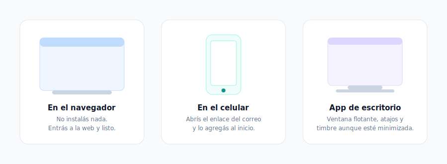

# Manual de Usuario

> **Para quién es este manual**
> Para vos, que vas a usar el teléfono todos los días. No hace falta saber nada de tecnología:
> si sabés usar una app del celular, sabés usar esto.

---

## 1. ¿Qué recibiste?

Tu administrador te mandó un **correo con un código QR** y un enlace. Con eso configurás tu
teléfono en un paso: no tenés que anotar contraseñas ni configurar nada a mano.

> El acceso **vence en 24 horas**. Si se te venció, pedile uno nuevo al administrador.

---

## 2. Elegí tu teléfono

Podés usar el que más te sirva. Los tres funcionan igual y podés tener varios a la vez.

| | Cuándo conviene |
|---|---|
| **En el navegador** | No instalás nada. Entrás a la web y ya tenés teléfono. |
| **En el celular** | Abrís el enlace del correo y lo agregás a la pantalla de inicio. |
| **App de escritorio (Windows)** | Si pasás el día llamando: ventana flotante, atajos, timbre aunque esté minimizada. |

---

## 3. Configurar la app de escritorio

1. Instalá **PBX-NG Softphone** (te lo pasa el administrador).
2. Al abrirla vas a ver la pantalla de acceso. Tocá el **botón de QR**, a la derecha del título.
3. Elegí **"Pegar código"** y pegá el enlace que te llegó por correo.
4. Listo: el teléfono se configura solo y queda en línea.

Cuando el punto de tu nombre está **verde**, estás en línea y podés llamar y recibir llamadas.

> **¿Querés el detalle completo de la app de Windows?** Instalación (`.exe` / `.msi` / portable),
> bandeja del sistema, arranque con Windows, atajos de teclado globales, ventana flotante,
> click-to-call, códecs, actualizaciones automáticas y solución de problemas están en el **Manual
> de la App de Escritorio (Windows)**. Este capítulo es el resumen para empezar rápido.

---

## 4. Iniciar sesión

» Softphone → botón QR (arriba a la derecha del título)

Hay **dos formas** de que tu teléfono se conecte a la central, y el administrador ya eligió cuál te
corresponde. La app te la deja configurada sola cuando usás el QR o el enlace; esta sección es para
que entiendas qué estás viendo, y para el caso en que tengas que cargarlo a mano.

### 4.1 Con el enlace o el QR (lo normal)

1. Abrí la app y tocá el **botón de QR**, a la derecha del título *"Conectar a tu central"*.
2. Si tenés cámara, escaneá el código del correo. Si no (una PC de escritorio, por ejemplo), la app
   te ofrece directamente **"Pegar código"**: pegá el enlace del correo.
3. La app detecta sola si tu extensión es **WebRTC** o **SIP**, se configura y queda en línea.

### 4.2 A mano: modo WebRTC

Es el modo habitual: el teléfono habla con la central **por Internet**, cifrado, sin necesidad de
puertos especiales en tu red. Funciona bien desde casa, desde el celular y detrás de casi cualquier
router.

| Campo | Qué poner | Ejemplo |
|---|---|---|
| **Servidor WebSocket (WSS)** | La dirección que te dio el administrador | `wss://pbx.tu-empresa.com/ws` |
| **Dominio SIP** | Suele ser el mismo dominio, sin el `wss://` | `pbx.tu-empresa.com` |
| **Extensión / usuario** | Tu número | `2001` |
| **Contraseña** | La de tu extensión | — |

### 4.3 A mano: modo SIP nativo

Es el modo clásico, el que usan los teléfonos de escritorio. Se usa cuando la central **no expone
WebRTC**, o cuando estás dentro de la red de la empresa.

| Campo | Qué poner | Ejemplo |
|---|---|---|
| **Servidor SIP** | Host o IP de la central | `192.168.1.10` |
| **Puerto** | 5060 para UDP/TCP, 5061 para TLS | `5060` |
| **Dominio SIP** | El dominio de la central | `pbx.tu-empresa.com` |
| **Extensión y contraseña** | Los tuyos | `2001` |

> **¿Cuál te toca?** No adivines: si el administrador te mandó el enlace, la app lo resuelve sola.
> Una extensión WebRTC **no** funciona bien en modo SIP nativo (el audio no levanta, porque la central
> le exige cifrado), y una extensión SIP clásico no tiene WebSocket al que conectarse.

### 4.4 Qué pasa después de conectar

La app hace una verificación en varios pasos y te la muestra: alcanza el servidor, negocia el
cifrado, se registra. Si algo falla, **te dice el motivo real** (por ejemplo *"Registro rechazado
(401) — revisá extensión/contraseña"*), no un error genérico.

Cuando el punto de tu nombre está **verde**, estás en línea.

### 4.5 Entrar también a la plataforma

Además del teléfono, tu acceso te conecta con el **sistema de la empresa**: así ves la ficha del
cliente que te llama, el directorio y el intercom. Si el administrador te dio ese permiso, ya viene
incluido en el enlace y no tenés que hacer nada.

Si alguna vez te desconectás, en **Ajustes → Sistema** podés volver a entrar con tu usuario y
contraseña del panel.

Y ya que entrás: **este manual está adentro de la plataforma**, en **Sistema → Manuales**. Lo podés
leer en pantalla o descargarlo en PDF, sin pedírselo a nadie.

---

## 5. Llamar

Marcá el número en el teclado y tocá el botón verde. También podés **escribir el nombre** de un
compañero: aparece solo mientras tipeás.

---

## 6. Recibir una llamada

Cuando te llaman, la app suena y aparece quién es. Si el número está en el sistema de clientes, vas
a ver **su ficha** antes de atender: sabés con quién hablás desde el "hola".

Atendés con el botón verde, rechazás con el rojo.

---

## 7. Durante la llamada

| Botón | Qué hace |
|---|---|
| **Silenciar** | El otro deja de escucharte. Vos lo seguís escuchando. |
| **Teclado** | Para marcar opciones ("marque 1 para…"). |
| **Retener** | La persona queda en espera con música. |
| **Transferir** | Le pasás la llamada a otra extensión. |
| **Video** | Encendés la cámara. |
| **Invitar** | Sumás a otra persona a la conversación. |
| **Grabar** | Empieza a grabar la llamada. |

> Abajo de la llamada vas a ver una etiqueta que dice **VÍA TURN** o **DIRECTO**. Es informativa: te
> dice por dónde viaja el audio. Si tenés problemas de sonido, ese dato le sirve al administrador.

---

## 8. La ventana flotante (app de escritorio)

Tocá el botón **mini** en la barra superior y el teléfono se convierte en una ventanita chica que
queda **siempre visible**, aunque estés en otra aplicación. Desde ahí atendés, silenciás, cortás y
controlás el volumen.

---

## 9. Tu buzón de voz

» Softphone → Voz  ·  o marcá *97 desde tu teléfono

Si no atendés, la persona puede dejarte un mensaje.

- **Desde el teléfono**: marcá `*97`. La primera vez, el PIN es tu número de extensión.
- **Desde la app**: en la sección **Voz** los escuchás, los leés transcritos y los borrás.
- **Por correo**: si el administrador lo activó, cada mensaje te llega al mail con el audio adjunto
  y **la transcripción escrita**. Te enterás de qué se trata sin escuchar nada.

---

## 10. Si trabajás con colas (agentes)

» Navegador → https://tu-dominio (entrás con tu usuario)

Tu panel muestra las llamadas en espera, tus estadísticas del día y tu historial.

- **Pausa**: si tenés que ausentarte, ponete en pausa y la cola deja de mandarte llamadas.
  **Volvé a activarte al regresar** — es el olvido más común.
- **Descanso entre llamadas**: después de cortar tenés unos segundos para tipificar antes de que
  entre la siguiente.
- **Historial**: cada llamada con su grabación y su transcripción.

---

## 11. Problemas frecuentes

» Softphone → Ajustes → Dispositivos  /  Ajustes → Diagnóstico

| Qué te pasa | Qué hacer |
|---|---|
| Dice **"sin conectar"** | Fijate que tengas internet. La app muestra el motivo real del fallo abajo del estado. |
| **No te escuchan** | Revisá el micrófono en Ajustes → Dispositivos, y que el navegador tenga permiso. |
| **No escuchás** | Revisá el altavoz en Ajustes → Dispositivos y el volumen de la llamada. |
| **Se corta el audio** | Suele ser la red. Pasale al administrador la etiqueta *VÍA TURN / DIRECTO* y la sección Diagnóstico. |
| **Se venció el acceso** | Pedile al administrador un enlace nuevo. |

---

## 12. Códigos útiles

| Código | Para qué |
|---|---|
| `*97` | Escuchar tu buzón de voz |
| `*98` | Entrar al buzón de otra extensión |
